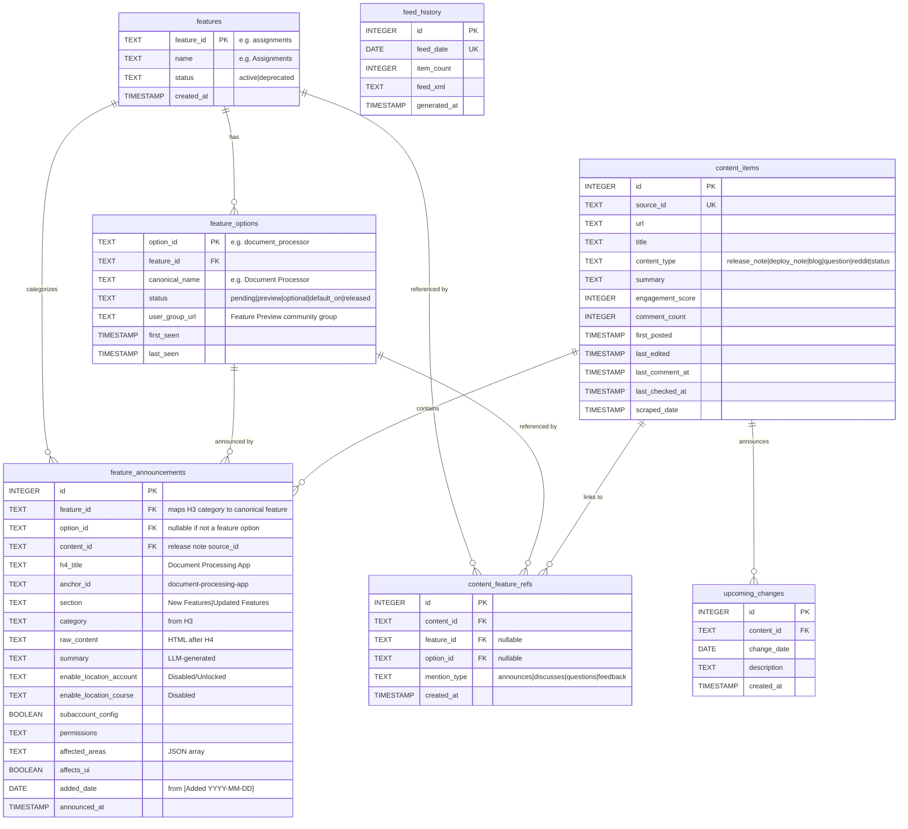

# Database Schema

**Last Updated:** 2026-02-04

## Overview

This document describes the database schema for tracking Canvas LMS release notes, features, and community content. The schema uses a **three-tier hierarchy** for feature tracking:

1. **features** - Canonical Canvas features (~45 top-level features like "Assignments", "Gradebook")
2. **feature_options** - Canonical feature options (from "Feature Option to Enable" table cell)
3. **feature_announcements** - Each H4 announcement about a feature option over time

---

## Release Notes Structure Mapping

### HTML Hierarchy

```text
H2 "New Features"           → Section type (runtime sorting, not stored)
  H3 "Assignments"          → Category → maps to features.feature_id
    H4 "Document Processing App"  → Announcement headline
      <table>
        "Feature Option to Enable" → "Document Processor" → feature_options.canonical_name
```

### Example Mapping

For the release note entry "Document Processing App" under "Assignments":

| Source | Value | Maps To |
|--------|-------|---------|
| H3 text | "Assignments" | `features.feature_id = "assignments"` |
| H4 text | "Document Processing App" | `feature_announcements.h4_title` |
| H4 data-id | "document-processing-app" | `feature_announcements.anchor_id` |
| Table: "Feature Option to Enable" | "Document Processor" | `feature_options.canonical_name` |
| Table: first `<p>` slugified | "document_processor" | `feature_options.option_id` |

---

## Schema Diagram



---

## Table Definitions

### features

Canonical Canvas features (~45 top-level features).

```sql
CREATE TABLE features (
    feature_id TEXT PRIMARY KEY,      -- e.g., 'assignments', 'gradebook'
    name TEXT NOT NULL,               -- e.g., 'Assignments', 'Gradebook'
    status TEXT DEFAULT 'active',     -- 'active', 'deprecated'
    created_at TIMESTAMP DEFAULT CURRENT_TIMESTAMP
);
```

### feature_options

Canonical feature options extracted from "Feature Option to Enable" table cell.

```sql
CREATE TABLE feature_options (
    option_id TEXT PRIMARY KEY,       -- slugified: 'document_processor'
    feature_id TEXT NOT NULL,         -- FK to features
    canonical_name TEXT NOT NULL,     -- exact: 'Document Processor'
    status TEXT NOT NULL DEFAULT 'pending',
        -- 'pending'    : Announced but not yet available
        -- 'preview'    : Feature preview / beta
        -- 'optional'   : Available but disabled by default
        -- 'default_on' : Enabled by default, can be disabled
        -- 'released'   : Fully released, no longer optional
    user_group_url TEXT,              -- Feature Preview community group URL
    first_seen TIMESTAMP,             -- When we first saw this option
    last_seen TIMESTAMP,              -- When we last saw this option announced
    FOREIGN KEY (feature_id) REFERENCES features(feature_id)
);

CREATE INDEX idx_feature_options_feature ON feature_options(feature_id);
CREATE INDEX idx_feature_options_status ON feature_options(status);
```

### feature_announcements

Each H4 entry from release notes, tracking announcements about feature options over time.

```sql
CREATE TABLE feature_announcements (
    id INTEGER PRIMARY KEY AUTOINCREMENT,
    feature_id TEXT,                  -- FK to features (maps H3 category to canonical feature)
    option_id TEXT,                   -- FK to feature_options (nullable for non-option announcements)
    content_id TEXT NOT NULL,         -- FK to content_items.source_id

    -- H4 metadata
    h4_title TEXT NOT NULL,           -- "Document Processing App"
    anchor_id TEXT,                   -- "document-processing-app" for deep linking
    section TEXT,                     -- "New Features", "Updated Features", etc.
    category TEXT,                    -- From H3: "Assignments", "Gradebook", etc.

    -- Content
    raw_content TEXT,                 -- HTML content after H4
    summary TEXT,                     -- LLM-generated summary

    -- Configuration snapshot at time of announcement
    enable_location_account TEXT,     -- "Disabled/Unlocked", "Enabled/Locked", etc.
    enable_location_course TEXT,      -- "Disabled", "Enabled", etc.
    subaccount_config BOOLEAN,        -- Can subaccounts configure?
    account_course_setting TEXT,      -- Additional setting name if needed
    permissions TEXT,                 -- "Inherent to user role", "Admin", etc.
    affected_areas TEXT,              -- JSON array: ["Grades", "SpeedGrader"]
    affects_ui BOOLEAN,               -- Does it affect user interface?

    -- Dates
    added_date DATE,                  -- From [Added YYYY-MM-DD] annotation
    announced_at TIMESTAMP NOT NULL,  -- Release note date
    created_at TIMESTAMP DEFAULT CURRENT_TIMESTAMP,

    FOREIGN KEY (feature_id) REFERENCES features(feature_id),
    FOREIGN KEY (option_id) REFERENCES feature_options(option_id),
    FOREIGN KEY (content_id) REFERENCES content_items(source_id)
);

CREATE INDEX idx_announcements_feature ON feature_announcements(feature_id);
CREATE INDEX idx_announcements_option ON feature_announcements(option_id);
CREATE INDEX idx_announcements_content ON feature_announcements(content_id);
CREATE INDEX idx_announcements_date ON feature_announcements(announced_at);
```

### content_items

All scraped content (release notes, blog posts, Q&A, Reddit, status).

```sql
CREATE TABLE content_items (
    id INTEGER PRIMARY KEY,
    source_id TEXT UNIQUE,            -- e.g., 'release_note_664643'
    url TEXT,
    title TEXT,
    content_type TEXT,                -- See Content Types below
    summary TEXT,                     -- LLM-generated (for non-release-note types)

    -- Engagement
    engagement_score INTEGER DEFAULT 0,
    comment_count INTEGER DEFAULT 0,

    -- Source dates
    first_posted TIMESTAMP,
    last_edited TIMESTAMP,
    last_comment_at TIMESTAMP,

    -- Our tracking
    last_checked_at TIMESTAMP,
    scraped_date TIMESTAMP DEFAULT CURRENT_TIMESTAMP,

    -- Deprecated columns (kept for backwards compat)
    source TEXT,                      -- Redundant with content_type
    content TEXT,                     -- Raw content, summary is sufficient
    published_date TIMESTAMP,         -- Use first_posted instead
    sentiment TEXT,                   -- Not used
    primary_topic TEXT,               -- Replaced by feature refs
    topics TEXT,                      -- Replaced by feature refs
    included_in_feed BOOLEAN          -- RSS-only concern
);

CREATE INDEX idx_content_type ON content_items(content_type);
CREATE INDEX idx_first_posted ON content_items(first_posted);
```

### content_feature_refs

Junction table linking content to features and/or feature options.

```sql
CREATE TABLE content_feature_refs (
    id INTEGER PRIMARY KEY AUTOINCREMENT,
    content_id TEXT NOT NULL,
    feature_id TEXT,                  -- FK to features (nullable)
    option_id TEXT,                   -- FK to feature_options (nullable)
    mention_type TEXT,                -- 'announces', 'discusses', 'questions', 'feedback'
    created_at TIMESTAMP DEFAULT CURRENT_TIMESTAMP,

    FOREIGN KEY (content_id) REFERENCES content_items(source_id),
    FOREIGN KEY (feature_id) REFERENCES features(feature_id),
    FOREIGN KEY (option_id) REFERENCES feature_options(option_id),
    CHECK (feature_id IS NOT NULL OR option_id IS NOT NULL)
);

CREATE UNIQUE INDEX idx_content_feature_refs_unique
    ON content_feature_refs(content_id, COALESCE(feature_id, ''), COALESCE(option_id, ''));
```

### upcoming_changes

Captures "Upcoming Canvas Changes" section from release notes.

```sql
CREATE TABLE upcoming_changes (
    id INTEGER PRIMARY KEY AUTOINCREMENT,
    content_id TEXT NOT NULL,         -- FK to content_items.source_id
    change_date DATE NOT NULL,
    description TEXT NOT NULL,
    created_at TIMESTAMP DEFAULT CURRENT_TIMESTAMP,

    FOREIGN KEY (content_id) REFERENCES content_items(source_id)
);

CREATE INDEX idx_upcoming_content ON upcoming_changes(content_id);
CREATE INDEX idx_upcoming_date ON upcoming_changes(change_date);
```

### feed_history

RSS feed generation history.

```sql
CREATE TABLE feed_history (
    id INTEGER PRIMARY KEY,
    feed_date DATE UNIQUE,
    item_count INTEGER,
    feed_xml TEXT,
    generated_at TIMESTAMP DEFAULT CURRENT_TIMESTAMP
);
```

---

## Content Types

| Type | Source | Description |
|------|--------|-------------|
| `release_note` | Instructure Community | New features, capabilities |
| `deploy_note` | Instructure Community | Bug fixes, patches |
| `changelog` | Instructure Community | API/CLI changes |
| `blog` | Instructure Community | Product blog posts |
| `question` | Instructure Community | Q&A forum posts |
| `reddit` | Reddit | r/instructure, r/canvas discussions |
| `status` | status.instructure.com | Incidents, outages |

---

## Table Parsing Requirements

The configuration table after each H4 requires careful parsing:

### "Feature Option to Enable" Cell

**Raw value:**

```text
"Document Processor\n\nSee the Canvas Feature Option Summary to learn more about Feature Options."
```

**HTML structure:**

```html
<p>Document Processor</p>
<p>See the <a href="...">Canvas Feature Option Summary</a> to learn more about Feature Options.</p>
```

**Parsing rule:** Extract text from **first `<p>` tag only**.

**Result:**

- `canonical_name` = "Document Processor"
- `option_id` = "document_processor" (slugified)

### "Enable Feature Option Location & Default Status" Cell

**Raw value:**

```text
"Account (Disabled/Unlocked)\n\nCourse (Disabled)"
```

**Parsing rule:** Split by newlines, parse each line for location and status.

**Result:**

- `enable_location_account` = "Disabled/Unlocked"
- `enable_location_course` = "Disabled"

### "Affected Areas" Cell

**Raw value:**

```text
"Assignment Details page, Grades, SpeedGrader,"
```

**Parsing rule:** Split by comma, trim whitespace, remove empty entries.

**Result:**

- `affected_areas` = `["Assignment Details page", "Grades", "SpeedGrader"]`

### Boolean Fields

| Cell Label | "Yes" | "No" |
|------------|-------|------|
| Subaccount Configuration | `true` | `false` |
| Affects User Interface | `true` | `false` |

---

## Migration Plan

### Phase 1: Schema Changes

1. **Create new table** `feature_announcements`
2. **Add columns** to `feature_options`:
   - `canonical_name TEXT`
   - Rename mental model: `option_id` is now slugified from canonical_name
3. **Create table** `upcoming_changes`

### Phase 2: Scraper Updates

1. **Update table parsing** in `_parse_feature_table()`:
   - Extract first `<p>` from "Feature Option to Enable"
   - Parse multi-line "Enable Feature Option Location"
   - Handle all new fields

2. **Update `classify_release_features()`**:
   - Create/update `feature_options` from canonical name
   - Create `feature_announcements` for each H4
   - Store config snapshot in announcement

### Phase 3: Data Flow

```
scrape_release_notes()
    │
    ├── parse_release_note_page()
    │       │
    │       └── For each H4:
    │           ├── Extract table → FeatureTableData (enhanced)
    │           └── Create Feature object
    │
    └── classify_release_features()
            │
            ├── Extract canonical_name from table
            ├── Upsert feature_options (canonical)
            ├── Insert feature_announcements (H4 snapshot)
            └── Insert content_feature_refs (linkage)
```

---

## Query Examples

### Get all announcements for a feature option

```sql
SELECT fa.*, ci.title as release_note_title
FROM feature_announcements fa
JOIN content_items ci ON fa.content_id = ci.source_id
WHERE fa.option_id = 'document_processor'
ORDER BY fa.announced_at DESC;
```

### Track feature option evolution over time

```sql
SELECT
    fa.announced_at,
    fa.h4_title,
    fa.enable_location_account,
    fa.enable_location_course
FROM feature_announcements fa
WHERE fa.option_id = 'document_processor'
ORDER BY fa.announced_at;
```

### Find all pending feature options

```sql
SELECT fo.*, f.name as feature_name
FROM feature_options fo
JOIN features f ON fo.feature_id = f.feature_id
WHERE fo.status IN ('pending', 'preview', 'optional')
ORDER BY fo.first_seen DESC;
```

### Get recent content with new comment activity

```sql
SELECT * FROM content_items
WHERE last_comment_at > datetime('now', '-7 days')
ORDER BY last_comment_at DESC;
```
